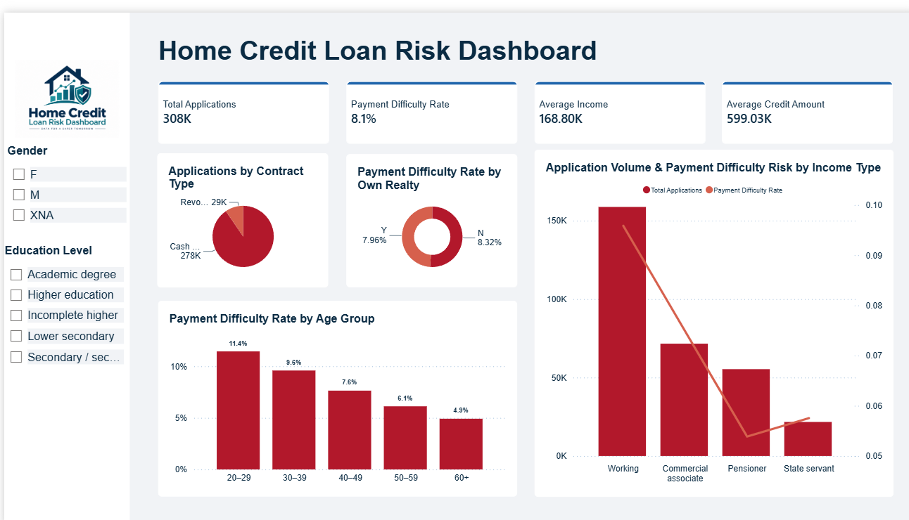

# Phase 9: Business Intelligence & Dashboarding (Power BI)

## 1. Overview
The final phase of our pipeline bridges Data Engineering and Business Intelligence. We connected Power BI to our optimized Data Warehouse (Hive/HDFS). By leveraging the Star Schema, we utilized the `Dim_Customer` table for interactive slicers and the `Fact_Loan` table for aggregating key financial metrics.

## 2. The Home Credit Loan Risk Dashboard

### A. Key Performance Indicators (KPIs)
* **Total Applications:** 308K
* **Payment Difficulty Rate (Default Risk):** 8.1%
* **Average Income:** 168.80K
* **Average Credit Amount:** 599.03K

### B. Core Dashboard Components & Insights

* **Interactive Slicers (Left Panel):**
  * **Gender:** Allows filtering by Female (F), Male (M), and Not Available (XNA).
  * **Education Level:** Enables drilling down into specific academic backgrounds (e.g., Higher education, Secondary).

* **Applications by Contract Type (Pie Chart):**
  * Demonstrates the distribution of loan types, showing that the vast majority (278K) are Cash loans compared to Revolving loans (29K).

* **Payment Difficulty Rate by Age Group (Bar Chart):**
  * **Key Insight:** Highlights a clear trend where younger applicants (20-29) carry the highest risk of default (11.4%). This risk consistently decreases with age, dropping to just 4.9% for applicants aged 60+.

* **Application Volume & Risk by Income Type (Combo Chart):**
  * **Key Insight:** The 'Working' class represents the highest volume of applications (~150K+) but also carries a higher risk. Conversely, 'Pensioners' show the lowest payment difficulty rate, indicating high financial stability.

* **Risk by Realty Ownership (Donut Chart):**
  * Shows a marginal difference in risk between those who own realty (7.96%) and those who do not (8.32%).